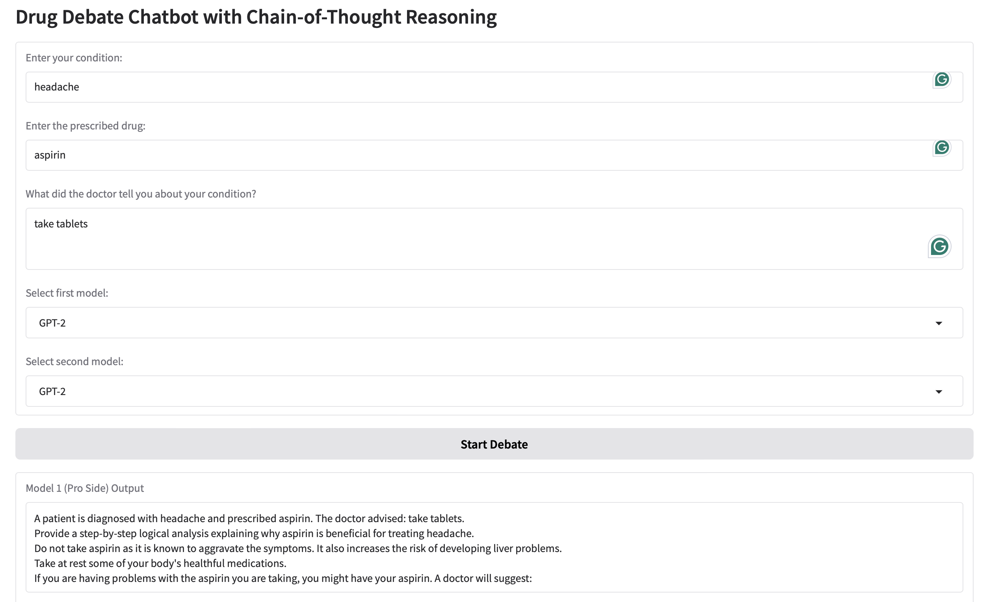

# Drug Debate Bot

## Overview

The **Drug Debate Chatbot** is an AI-powered tool designed to enhance **patient awareness** and **safety** by simulating a structured debate between two AI models on the effects of prescribed drugs. This chatbot helps patients understand both the **benefits** and **potential risks** of a medication, enabling **informed decision-making** in consultation with their healthcare provider.

## Key Features

- **Patient-Centered Debate:** Uses two AI models to argue **for** and **against** a prescribed drug based on the patient's condition.
- **Chain-of-Thought Processing:** AI models follow a structured reasoning approach to explain drug effects step by step.
- **Doctor’s Advice Integration:** Patients can input what their doctor told them, ensuring responses are personalized.
- **Interactive Drug Selection:** A dropdown list suggests available drugs based on the patient’s condition.
- **User-Friendly Interface:** Built with **Gradio** for easy accessibility and intuitive interaction.

## How It Works

1. The patient enters their **medical condition**.
2. The chatbot provides a **dropdown list of prescribed drugs** for that condition.
3. The patient selects a **drug** and enters **doctor's advice**.
4. The user chooses two AI models to **debate the drug's pros and cons**.
5. The AI generates structured responses:
   - **Model 1 (Pro Side):** Explains why the drug is beneficial.
   - **Model 2 (Con Side):** Discusses risks and alternative treatments.

## Installation & Usage

### Prerequisites

Ensure you have Python installed. Install dependencies using:

```bash
pip install gradio transformers torch
```

### Running the Chatbot

```bash
python DrugAwaRE.ipynb
```

or, if using **Google Colab**, run the script and access the chatbot via the generated link.



## Why This Matters?

- **Empowers Patients:** Provides critical insights into medication effects.
- **Enhances Safety:** Highlights potential side effects and alternatives.
- **Bridges Communication Gaps:** Helps patients understand medical advice in a clear, structured manner.

## Future Enhancements

- **Integration with Medical Databases:** For up-to-date drug research.
- **Multilingual Support:** To reach a broader audience.
- **Personalized AI Assistants:** Fine-tuned models for specific conditions.

---

### Contributors

- **Prannov Jamadagni**
- **Rushitha Akula**
- Open to contributions! Feel free to submit issues or pull requests.

### License

This project is licensed under the **MIT License**.

---

🚀 **Empowering patients through AI-driven medical awareness!**
```

This README is structured for a **GitHub repository**, providing **clear documentation** for users and contributors. Let me know if you need modifications! 🚀
